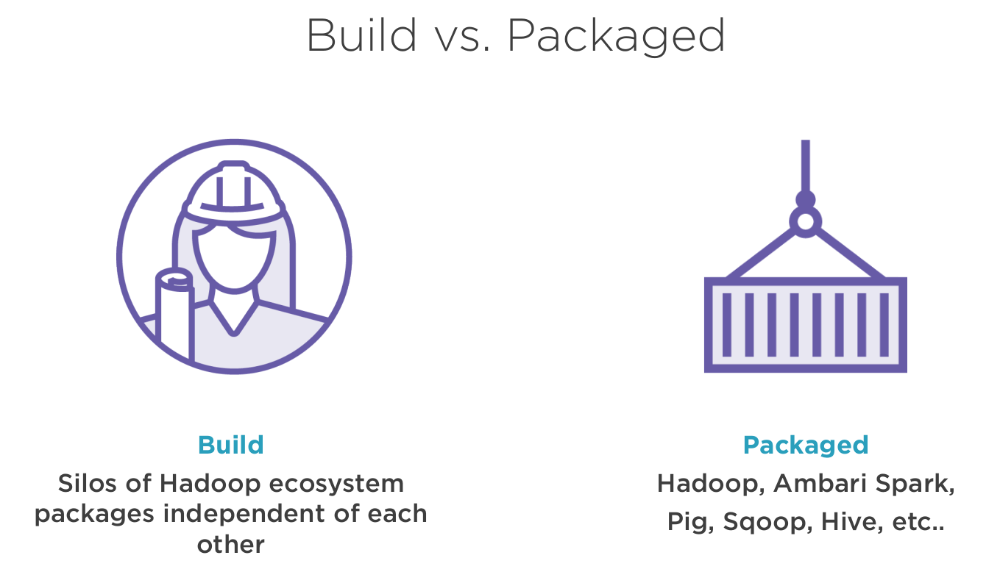

# Hortonworks Data Platform

## Giới thiệu

- Trước tiên khi nói đến HDP, sẽ nói đến Hadoop

### Hadoop

Hadoop là một Java framework dựa trên Node cho phép xử lý các tập dữ liệu lớn trong môi trường phân tán.
Ban đầu, nó được tạo thành từ 2 thành phần: MapReduce và HDFS. Sau này, khi nói đến Hadoop, người ta thường nói đến cả 1
hệ sinh thái xung quanh nó.

### HDP

- Hortonworks Data Platform (HDP) is an open source framework for distributed storage and processing of large,
  multi-source data sets.
- HDP modernizes your IT infrastructure and keeps your data secure—in the cloud or on-premises—while helping you drive
  new revenue streams, improve customer experience, and control costs.

- HDP đã cung cấp một nền tảng toàn diện và tích hợp để quản lý dữ liệu lớn và cung cấp một bộ công cụ để nhập, xử lý,
  lưu
  trữ và phân tích dữ liệu. Nó cũng cung cấp các tính năng bảo mật và quản trị để quản lý và bảo vệ dữ liệu, bao gồm xác
  thực, ủy quyền và ghi nhật ký kiểm tra.

- Một trong những lợi ích chính của việc sử dụng HDP là dễ sử dụng và quản lý, vì nó cung cấp một nền tảng duy nhất để
  quản lý tất cả các thành phần của hệ sinh thái Hadoop. Nó cũng cung cấp dịch vụ và hỗ trợ cấp doanh nghiệp để đảm bảo
  tính ổn định và độ tin cậy của nền tảng.

- Với từng phiên bản HDP, lại có những bộ công cụ đi kèm khác nhau, nhưng có thể thêm/bớt. Ví dụ: ở phiên bản
  3.1.5 so với phiên bản 2.6.5: HDP đã bổ sung NiFi, Storm, Druid, Flink, Solr, ...

#### Trên đây là 5 trụ cột của HDP (cũng chính là 5 trụ cột của Hadoop) đảm bảo tính sẵn sàng cho doanh nghiệp:

- Data Management: lưu trữ và xử lý dữ liệu
    - Apache Hadoop YARN, HDFS
- Data Access: truy cập và tương tác với dữ liệu trên 1 loạt các công cụ: Batch, Script, SQL, NoSQL, ...
    - Apache Hive, Apache Pig, MapReduce, Apache Spark, Apache Storm, Apache HBase, ...
- Data Governance & Integration: Nhanh chóng và dễ dàng tải dữ liệu, quản lí dựa trên policy
    - Apache Sqoop, Workflow Management, Apache Flume, ...
- Security: Quản lý các policy một cách nhất quán trên các yêu cầu để xác thực, cấp phép, kiểm tra và bảo vệ dữ liệu
    - Apache Knox, Apache Ranger
- Operations:
    - Apache Ambari, Apache Oozie, Apache ZooKeeper

### Hortonworks = Hadoop?

Nếu nói như vậy, Hadoop tương đương với Hortonworks? Không phải, Hortonworks giống như 1 package chứa những tập hợp
phiên bản stable của Hadoop, opensource, nhưng không hẳn là bản mới nhất hay tốt nhất. Hortonworks phù hợp với
enterprise cần sự ổn định. Khi áp dụng vào cho doanh nghiệp, cần đảm bảo những phiên bản sử dụng là ổn định nhất, có giá
trị sử dụng cao nhất.

Thông tin thêm:

Hortonworks là 1 trong những contributor chính trong code và patch cho các projects trong hệ sinh thái Hadoop. Những
projects này thì đã được tích hợp và kiểm thử như là 1 phần bên trong quá trình release của HDP và cài đặt cũng như
những tool cấu hình cũng được bao gồm.

## Features / Skills

Hadoop miễn phí, opensource, vậy Hortonworks sẽ phù hợp trong kịch bản nào?

- Mặc dù tất cả các thành phần của HDP đều là mã nguồn mở, nhưng việc tích hợp và quản lý chúng có thể là một nhiệm vụ
  phức tạp và tốn thời gian, có rất nhiều component cần phải quản lý: Apache Hive, Spark, HDFS, YARN, ... việc
  quản lý và update version cho từng component phức tạp -> có rất nhiều dependencies.
- HDP như 1 orchestration đã cung cấp một nền tảng đã được thử nghiệm và định cấu hình sẵn giúp các tổ chức triển khai
  và quản lý cơ sở hạ tầng dữ liệu lớn của họ dễ dàng hơn
- Ngoài ra, các dịch vụ và hỗ trợ cấp doanh nghiệp của HDP cung cấp mức độ tin cậy và bảo mật bổ sung cho các tổ chức
  yêu cầu.

Nghĩ về tất cả những projects khác nhau mà chúng ta có, với mỗi service lại có từng file cấu hình riêng biệt, do đó 1 cơ
hội khác cho chúng ta để có thể cấu hình và có thể điều chỉnh ứng dụng cho hiệu suất tốt hơn hoặc tốt hơn hiệu quả lưu
trữ, hoặc chỉ đơn giản là tăng trải nghiệm sử dụng.
Nhưng chúng ta có quá nhiều file phải quản lý, đó là nơi mà Ambari tồn tại, và nó thực sự giúp chúng ta có thể quản lý
và phân bổ cách chúng ta có thể làm tất cả những điều đó so với việc xem từng tệp cấu hình riêng lẻ.

Apache Ambari là một framework dùng để cung cấp, quản lý và giám sát Apache Hadoop Cluster. Nó cung cấp một giao diện
đơn giản để quản lý cluster.

HDP cung cấp nhiều tool cho lập trình viên, ví dụ như là Apache Spark, Apache Hive, Apache ZooKeeper, ...

Apache ZooKeeper cung cấp một dịch vụ cấu hình phân phối, đồng bộ, và đặt tên cho hệ thống phân phối. Ứng dụng phân tán
này giúp ZooKeeper lưu trữ và cập nhật thông tin cấu hình.

...

Khi muốn xây dựng 1 hạ tầng Hadoop, sự lựa chọn của mọi người là tự build từ những project trong hệ sinh thái Hadoop hay
hạ tầng Hadoop đã được đóng gói? -> Theo quan điểm cá nhân khoảng 90% sẽ chọn lựa Hadoop đã được đóng gói.

Nhưng thêm vào đó, việc tự dựng từ những project cần phải tải xuống và cài đặt các gói Hadoop từ Apache, đồng thời cập
nhật Hadoop và tất cả các phần của hệ sinh thái.
Bên cạnh đó, Hadoop là open source, vì vậy, các phiên bản stable mới liên tục được phát hành. Giữ cho việc cập nhật là
việc khó, kết hợp với những ứng dụng khác để điều phối, báo cáo, tích hợp, làm sao để cập nhật những ứng dụng đó với bản
phát hành stable mới nhất? Đây là 1 thách thức lớn mà nhiều nhà quản trị phải đối mặt, nhưng nó đã được trừu tượng hóa
khi sử dụng 1 hệ thống được đóng gói như HDP.

### Một số điểm đáng chú ý khi quản trị hạ tầng HDP

#### Manage users

- Đảm bảo ai có quyền truy cập vào HDP. Đảm bảo chắc chắn dữ liệu của 1 group không bị truy cập từ những group không có
  quyền truy cập. HDP cung cấp cách để quản lý và truy cập dữ liệu cho nhiều users và setup những group của users.

- Quản lý tập trung với Ambari
- Các tính năng bảo mật tích hợp sẵn có:
    - Bao gồm Kerberos authentication, RBAC, encryption, audit logging, authorization, Apache Ranger
    - Manage and access data for users and set up those groups and users: setup different users, groups and permissions

#### Data protection

Còn về vấn đề bảo vệ dữ liệu? Đây là những ứng dụng cho doanh nghiệp.
Làm cách nào để đảm bảo rằng khi một trang web ngừng hoạt động, dữ liệu của bạn sẽ được bảo vệ? Rằng bạn biết rằng nó
vẫn ở đó? Điều gì về việc giữ cho dữ liệu đó luôn hoạt động? Làm thế nào về tính sẵn sàng cao? Bạn có thể backup
snapshot không? Bạn có thể quay lại phiên bản khác không? Đó là nơi bảo vệ dữ liệu trở thành một phần quan trọng đối với
HDP.

- Tính sẵn sàng cao (High availability):
    - Trên Hadoop 2.x, Primary NameNode và Secondary NameNode chia sẻ cùng 1 Journal.
    - Trên Hadoop 3.x, cho phép nhiều NameNodes so với chỉ có 2. Nhưng chỉ có 1 NameNode thực sự
        - NameNodes share the journal to protect data loss during writes -> if the NameNode goes down during the writes,
          got that Shared Journal -> recover it -> Secondary NameNode can pick up right where we left off.
        - Support more than 2 NameNodes
        - Cold data tiers
        - Active - standby: 1 NameNode is active and others are in standby mode.

#### Sharing resources

What about being able to share resources, how do you handle sharing & queuing?

- In Hadoop clusters, sharing resources and queuing is typically managed through a resource manager and a scheduler. HDP
  uses Apache YARN as the resource manager and scheduler, which allows different teams and users to share resources and
  manage workloads.

## How to setup HDP

- Hiện tại, Hortonworks và Cloudera đã được merge lại với nhau -> Policy mới không cho phép download bộ cài HDP free
  nữa.
  Cần phải download từ các nguồn khác, chỉ còn thấy bộ cài với CentOS 7

### Ambari

- Maintenance mode
- Ambari Server is installed in the NameNode and Ambari Agents are installed in every node. The Ambari Agents send
  Heartbeats to the server at frequent interval of time.

#### Manage configuration files in 1 place

- Easier rollback

#### Manage alerts

- It helps us manage different alerts and helping us be proactive with some of our maintenance. So as errors start to
  come in, we have warnings that say hey, something might be starting to happen with a service so that we can be in
  front of it, and ultimately have better uptime for our whole Hadoop cluster
- Severity:
    - OK
    - Warning
    - Critical
    - **Unknown**
- Send alerts by group of services (Pig, HDFS, Kafka, HBASE)
- Send through email or SNMP

### Demo