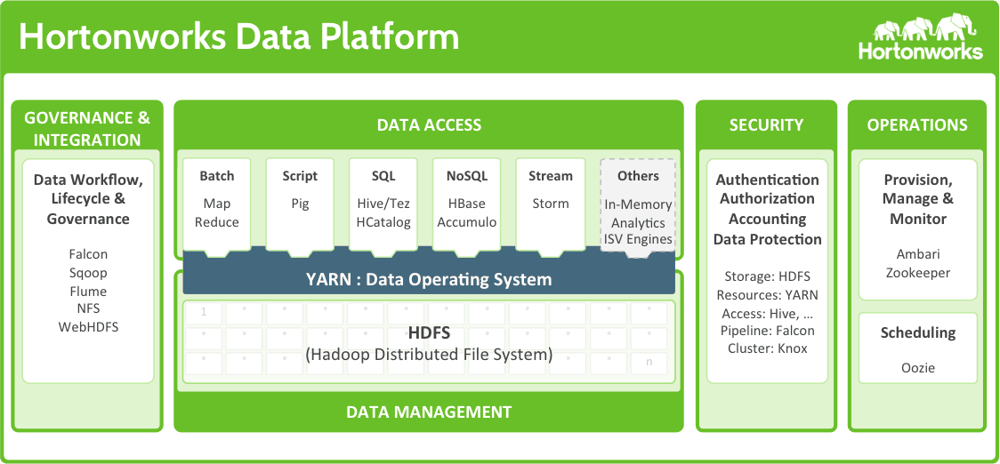
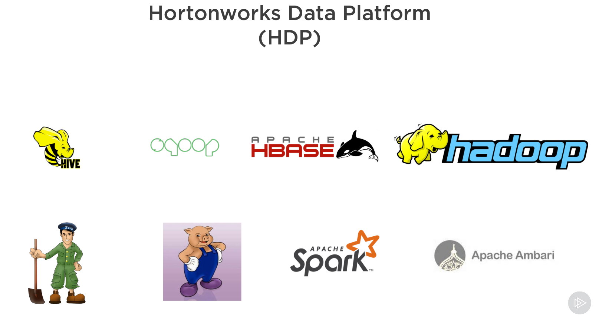
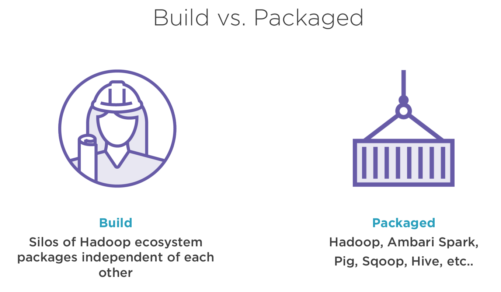

# Hortonworks Data Platform

## Introduction

- Hortonworks Data Platform (HDP) is an open source framework for distributed storage and processing of large,
  multi-source data sets.
- HDP modernizes your IT infrastructure and keeps your data secure—in the cloud or on-premises—while helping you drive
  new revenue streams, improve customer experience, and control costs.

HDP đã cung cấp một nền tảng toàn diện và tích hợp để quản lý dữ liệu lớn và cung cấp một bộ công cụ để nhập, xử lý, lưu
trữ và phân tích dữ liệu. Nó cũng cung cấp các tính năng bảo mật và quản trị để quản lý và bảo vệ dữ liệu, bao gồm xác
thực, ủy quyền và ghi nhật ký kiểm tra.

Một trong những lợi ích chính của việc sử dụng HDP là dễ sử dụng và quản lý, vì nó cung cấp một nền tảng duy nhất để
quản lý tất cả các thành phần của hệ sinh thái Hadoop. Nó cũng cung cấp dịch vụ và hỗ trợ cấp doanh nghiệp để đảm bảo
tính ổn định và độ tin cậy của nền tảng.

- Với từng phiên bản HDP khác nhau, lại có những bộ công cụ đi kèm khác nhau, nhưng có thể thêm/bớt. Ví dụ: ở phiên bản 3.1.5 so với phiên bản 2.6.5: HDP đã bổ sung NiFi, Storm, Druid, Flink, Solr, ...

## Features / Skills

- **Note**: cần phải nêu bật được ra những tính năng đáng tiền của HDP. Ví dụ: HA, ...

- Mặc dù tất cả các thành phần của HDP đều là mã nguồn mở, nhưng việc tích hợp và quản lý chúng có thể là một nhiệm vụ
  phức tạp và tốn thời gian, có rất nhiều component cần phải quản lý: Apache Hive, Spark, HDFS, YARN, ... nhưng việc
  quản lý và update version cho từng component phức tạp -> có rất nhiều dependencies.
- HDP như 1 orchestration đã cung cấp một nền tảng đã được thử nghiệm và định cấu hình sẵn giúp các tổ chức triển khai
  và quản lý cơ sở hạ tầng dữ liệu lớn của họ dễ dàng hơn
- Ngoài ra, các dịch vụ và hỗ trợ cấp doanh nghiệp của HDP cung cấp mức độ tin cậy và bảo mật bổ sung cho các tổ chức
  yêu cầu.

### Hortonworks = Hadoop?

Hortonworks is the major contributor of code and patches to many of these projects. These projects have been integrated and tested as part of the Hortonworks Data Platform release process and installation and configuration tools have also been included.

As a reminder, think of all the different projects that we have here, and each one of these has their own individual
configuration files, so it's another opportunity for us to be able to configure and be able to tune an application for
better performance or better storage efficiency, or just a better user experience on the back end, but all these are
different configuration files that we have to manage, and this is where Ambari comes in, and it really helps us be able
to manage and allocate how we can do all that versus trying to go out and look at each individual configuration file
Có rất nhiều file cấu hình riêng lẻ của từng dịch vụ, đó là lí do mà những gì HDP cung cấp trở nên hữu dụng

Do you want to build your own Hadoop infrastructure, or do you want to use a packaged Hadoop platform? My opinion is 90%
of people will prefer to use a packaged platform, but more on that later. Building your own Hadoop environment involves
downloading and installing Hadoop packages from Apache and keeping the core Hadoop and all the ecosystem pieces updated.
Doesn't sound too hard at first, but Hadoop is a huge ecosystem with many different dependencies on other applications.
Also, Hadoop is open source, which means new stable versions are constantly being released. Keeping up with the updates
just on Hadoop is hard, but compound that with other applications for orchestration, reporting, integration, how will I
keep those applications updated with the most current stable release? This is a huge challenge that many administrators
face, which is abstracted away when you use a package system like HDP or Hortonworks.

### Manage users

### Data protection

- High availability:
  - In Hadoop 2.x, Primary NameNode and Secondary NameNode shared the same Journal.
  - In Hadoop 3.x thì có multiple NameNodes vs. just having 2. Only 1 real NameNode
    - NameNodes share the journal to protect data loss during writes -> if the NameNode goes down during the writes, got that Shared Journal -> recover it -> Secondary NameNode can pick up right where we left off.
    - Support more than 2 NameNodes 
    - Cold data tiers
    - Active - standby: 1 NameNode is active and others are in standby mode.

### Sharing resources

## How to provision HDP

- Hiện tại, Hortonworks và Cloudera đã được merge lại với nhau -> Policy mới không cho phép download bộ cài HDP free
  nữa.
  Cần phải download từ các nguồn khác, chỉ còn thấy bộ cài với CentOS 7
- HDP on Geo: đang chạy bản nào, các thành phần trong hạ tầng như nào, version gì.
  TODO

### Ambari

- Ambari Server is installed in the NameNode and Ambari Agents are installed in every node. The Ambari Agents send
  Heartbeats to the server at frequent interval of time.

#### Manage configuration files in 1 place
- Easier rollback

#### Manage alerts

- It helps us manage different alerts and helping us be proactive with some of our maintenance. So as errors start to
  come in, we have warnings that say hey, something might be starting to happen with a service so that we can be in
  front of it, and ultimately have better uptime for our whole Hadoop cluster
- Severity:
  - OK
  - Warning
  - Critical
  - **Unknown**
- Send alerts by group of services (Pig, HDFS, Kafka, HBASE)
- Send through email or SNMP