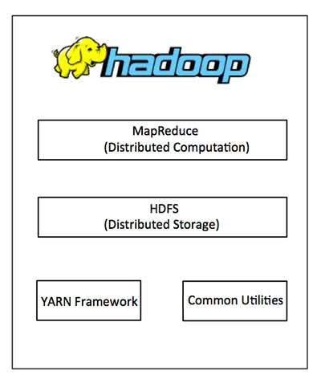
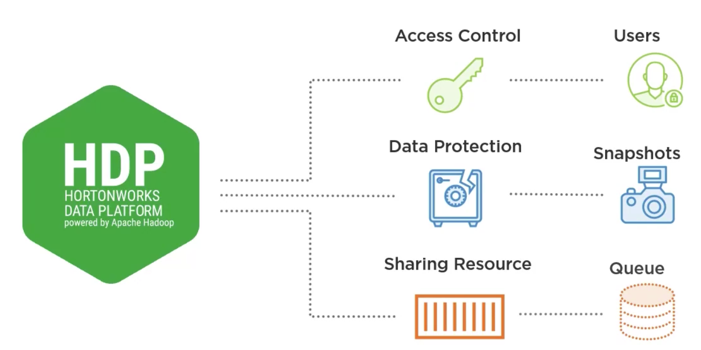

# Hortonworks Data Platform

## Introduction

### Hadoop

Apache Hadoop is an open source framework that is used to efficiently store and process large datasets ranging in size
from gigabytes to petabytes of data.

### Hortonworks Data Platform (HDP)

- Hortonworks Data Platform (HDP) is an open source framework for distributed storage and processing of large,
  multi-source data sets.
- HDP modernizes your IT infrastructure and keeps your data secure—in the cloud or on-premises—while helping you drive
  new revenue streams, improve customer experience, and control costs.

HDP đã cung cấp một nền tảng toàn diện và tích hợp để quản lý dữ liệu lớn và cung cấp một bộ công cụ để nhập, xử lý, lưu
trữ và phân tích dữ liệu. Nó cũng cung cấp các tính năng bảo mật và quản trị để quản lý và bảo vệ dữ liệu, bao gồm xác
thực, ủy quyền và ghi nhật ký kiểm tra.

Một trong những lợi ích chính của việc sử dụng HDP là dễ sử dụng và quản lý, vì nó cung cấp một nền tảng duy nhất để
quản lý tất cả các thành phần của hệ sinh thái Hadoop. Nó cũng cung cấp dịch vụ và hỗ trợ cấp doanh nghiệp để đảm bảo
tính ổn định và độ tin cậy của nền tảng.

- Each HDP version contains of different services. Example: 3.1.5 vs. 2.6.5: HDP added NiFi, Storm, Druid, Flink,
  Solr, ...

#### Five pillars of HDP (Hadoop) that make it enterprise ready:

- Data Management: Store and process vast quantities of data in a storage layer that scales linearly
    - Apache Hadoop YARN, HDFS
- Data Access: Interact with your data in a wide variety of ways – from batch to real-time
    - Apache Hive, Apache Pig, MapReduce, Apache Spark, Apache Storm, Apache HBase, ...
- Data Governance & Integration: Quickly and easily load data, and manage according to policy
    - Apache Sqoop, Workflow Management, Apache Flume, ...
- Security: Address requirements of Authentication, Authorization, Accounting and Data Protection
    - Apache Knox, Apache Ranger
- Operations: Provision, manage, monitor and operate Hadoop clusters at scale.
    - Apache Ambari, Apache Oozie, Apache ZooKeeper

### Hortonworks = Hadoop?

No, Hortonworks offers a package that includes a stable version of Hadoop, so it is the open-source version of Hadoop,
but it's not going to be the latest and greatest and bleeding edge. This is more of an enterprise piece that you can use
that's going to be stable. So, think about being able to have your applications that are using Hadoop. You want to make
sure that you have the best available and stable versions.

More information:

Hortonworks is the major contributor of code and patches to many of these projects. These projects have been integrated
and tested as part of the Hortonworks Data Platform release process and installation and configuration tools have also
been included.

## Features / Skills

Hadoop is open source, where does Hortonworks fit into this scenario?

- Mặc dù tất cả các thành phần của HDP đều là mã nguồn mở, nhưng việc tích hợp và quản lý chúng có thể là một nhiệm vụ
  phức tạp và tốn thời gian, có rất nhiều component cần phải quản lý: Apache Hive, Spark, HDFS, YARN, ... nhưng việc
  quản lý và update version cho từng component phức tạp -> có rất nhiều dependencies.
- HDP như 1 orchestration đã cung cấp một nền tảng đã được thử nghiệm và định cấu hình sẵn giúp các tổ chức triển khai
  và quản lý cơ sở hạ tầng dữ liệu lớn của họ dễ dàng hơn
- Ngoài ra, các dịch vụ và hỗ trợ cấp doanh nghiệp của HDP cung cấp mức độ tin cậy và bảo mật bổ sung cho các tổ chức
  yêu cầu.

Think of all the different projects that we have here, and each one of these has their own individual
configuration files, so it's another opportunity for us to be able to configure and be able to tune an application for
better performance or better storage efficiency, or just a better user experience on the back end, but all these are
different configuration files that we have to manage, and this is where Ambari comes in, and it really helps us be able
to manage and allocate how we can do all that versus trying to go out and look at each individual configuration file

Do you want to build your own Hadoop infrastructure, or do you want to use a packaged Hadoop platform? My opinion is 90%
of people will prefer to use a packaged platform, but more on that later. Building your own Hadoop environment involves
downloading and installing Hadoop packages from Apache and keeping the core Hadoop and all the ecosystem pieces updated.
Doesn't sound too hard at first, but Hadoop is a huge ecosystem with many different dependencies on other applications.
Also, Hadoop is open source, which means new stable versions are constantly being released. Keeping up with the updates
just on Hadoop is hard, but compound that with other applications for orchestration, reporting, integration, how will I
keep those applications updated with the most current stable release? This is a huge challenge that many administrators
face, which is abstracted away when you use a package system like HDP or Hortonworks.

### Manage users

- So who has access to the HDP environment? Can people who need to get access to HDP environment get access to it? Can
  we be sure that data from one group is not being able to be accessed from groups that aren't supposed to have that
  access? That's where access control really comes into it and HDP gives you a way to manage and access data for
  different users and set up those groups and users.
- Centralized management with Ambari
- Built-in security features
    - Include Kerberos authentication, RBAC, encryption, audit logging, authorization, Apache Ranger
    - Manage and access data for users and set up those groups and users: setup different users, groups and permissions

### Data protection

How do you make sure that when one site goes down that your data is protected? That you know that it's still there? What
about keeping that data up and going? How about high availability? Can you do snapshots? Can you roll back to a
different version? That's where data protection becomes a big piece for HDP.

- High availability:
    - In Hadoop 2.x: Primary NameNode and Secondary NameNode shared the same Journal.
    - In Hadoop 3.x: multiple NameNodes vs. just having 2. Only 1 real NameNode
        - NameNodes share the journal to protect data loss during writes -> if the NameNode goes down during the writes,
          got that Shared Journal -> recover it -> Secondary NameNode can pick up right where we left off.
        - Support more than 2 NameNodes
        - Cold data tiers
        - Active - standby: 1 NameNode is active and others are in standby mode.

### Sharing resources

What about being able to share resources, how do you handle sharing & queuing?

- In Hadoop clusters, sharing resources and queuing is typically managed through a resource manager and a scheduler. HDP
  uses Apache YARN as the resource manager and scheduler, which allows different teams and users to share resources and
  manage workloads.

## How to setup HDP

- Currently, Hortonworks and Cloudera are merged -> Cannot install HDP from original source.
  Download from other source, for CentOS 7.

### Ambari

- Maintenance mode
- Ambari Server is installed in the NameNode and Ambari Agents are installed in every node. The Ambari Agents send
  Heartbeats to the server at frequent interval of time.

#### Manage configuration files in 1 place

- Easier rollback

#### Manage alerts

- It helps us manage different alerts and helping us be proactive with some of our maintenance. So as errors start to
  come in, we have warnings that say hey, something might be starting to happen with a service so that we can be in
  front of it, and ultimately have better uptime for our whole Hadoop cluster
- Severity:
    - OK
    - Warning
    - Critical
    - **Unknown**
- Send alerts by group of services (Pig, HDFS, Kafka, HBASE)
- Send through email or SNMP

### Demo